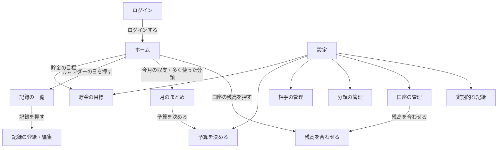

# 家計簿アプリ 画面設計書

## 1. この文書について

[要件定義書](要件定義書.md) の機能を、どの画面で・どのように使うかを決める。データの持ち方は [データベース設計書](データベース設計書.md) のとおり。

- 画面の図（ワイヤーフレーム）は、線と文字だけで「何を・どこに置くか」を表す。色やフォントなどの見た目は、6 章で決める。
  - ほかに考えた案：画面の図を画像にする。選ばなかった理由：文字と記号なら設計書の中にそのまま書け、直したところが Git の変更の記録でわかるため。
- 案を比べるときの下書きは、[画面の下書き](画面の下書き.html)（ブラウザで開く）にある。下書きの「選んだことの一覧」で、何と何を比べてどれを選んだかが見られる。
- README に載せる画面の画像は、作ったあとの本物の画面にする。
  - ほかに考えた案：下書きの画像を載せる。選ばなかった理由：下書きは本物の画面と見た目がちがい、読む人がまちがえるため。また、下書きのままの画面では見づらさがある（画面設計の下書きも、見やすいように変えてある）。
- 金額などの数字は、すべて例。

## 2. 画面一覧

| No | 画面 | URL | 段階 | 何をする画面か |
|---|---|---|---|---|
| 1 | ログイン | `/login` | 1 | ログインする |
| 2 | ホーム | `/` | 1 | 今の残高、今月の収支（ひと目でわかる数字だけ）、今月のカレンダー、記録するボタン。第 2 段階で、使える額・カレンダーの予定・金額が未入力のお知らせ（押すとその場で開き、金額を入れられる）を足す |
| 3 | 記録の一覧 | `/records` | 1 | 記録を見る・探す。第 2 段階で検索・絞り込みを足す |
| 4 | 記録の登録・編集 | `/records/create`<br>`/records/{id}/edit` | 1 | 収入・支出・移動を入力する。新しい相手もここで追加できる |
| 5 | 月のまとめ | `/summary` | 1 | 月を切りかえて（過去の月も）、収支・分類ごとの合計・相手ごとの合計を見る。第 3 段階で予算の状況とグラフを足す |
| 6 | 口座の管理 | `/accounts`<br>`/accounts/create`<br>`/accounts/{id}/edit` | 1 | 口座の追加・変更・削除・使わない、最初の残高 |
| 7 | 残高を合わせる | `/accounts/{id}/adjust` | 1 | 実際の金額を入れて、差を「調整」の記録として残す。ホームの残高の一覧と、口座の管理から開く |
| 8 | 分類の管理 | `/categories`<br>`/categories/create`<br>`/categories/{id}/edit` | 1 | 大分類・小分類の追加・変更・削除・使わない |
| 9 | 相手の管理 | `/partners`<br>`/partners/create`<br>`/partners/{id}/edit` | 1 | 相手の追加・変更・削除・使わない |
| 10 | 定期的な記録 | `/recurrings` | 2 | 上：月ごとの金額（月を切りかえて、見る・入れる・直す）。下：予定の登録・変更・使わない |
| 11 | 予算を決める | `/budgets` | 3 | ふだんの予算と、特別な月だけの予算を決める。予算の状況は月のまとめで見る |
| 12 | 設定 | `/settings` | 1 | 定期的な記録・口座・分類・相手・予算・貯金の目標の画面へのリンクを並べる。スマホのメニューの「設定」から開く（パソコンでは、左のメニューに全部出る） |
| 13 | 貯金の目標 | `/goals`<br>`/goals/create`<br>`/goals/{id}/edit` | 3 | 貯金の目標の追加・変更・削除と、進み具合（選んだ口座の残高 ÷ 目標額） |

- URL は、扱うテーブルの名前を最初に置く（例：口座 → accounts → `/accounts`）。月のまとめは、1 つのテーブルではなく記録を集計する画面なので、「まとめ」の英語 summary にした。
- `{id}` には、記録や口座の番号が入る（例：5 番の記録の編集 → `/records/5/edit`）。
- 口座・分類・相手・定期的な記録の追加・変更は、一覧とは別の画面でする（5.6 で決めた。記録の登録・編集と同じ動きにして、どの画面でも同じ手順で使えるようにするため）。URL は、一覧の URL のあとに追加は `/create`、変更は `/{id}/edit` をつける。
- ログアウトは画面ではなく、メニューのボタン。
- 設定は、1 つのテーブルではなく、ほかの画面へのリンクを並べる画面なので、「設定」の英語 settings にした。

**画面一覧を決めるときに考えたほかの案**

- **月のまとめ（No.5）**：集計を、ホームと記録の一覧に分けて出す。選ばなかった理由：見たい集計があちこちに散らばり、どこで何を見るか迷うため。ホームは今月のひと目でわかる数字だけにし、くわしい集計は月のまとめに集めた。
- **残高を合わせる（No.7）**：記録の登録の中で、調整の金額を入れる。選ばなかった理由：差を自分で計算して入れるのは面倒で、続かないため。実際の金額を入れるだけで差を出してくれる小さな画面にした。
- **予算とグラフ（No.5・No.11）**：
  - ア：予算の状況とグラフを 1 つの画面に集める。選ばなかった理由：見やすいが、分類の表（月のまとめ）と円グラフ（この画面）が別の画面に分かれ、同じ月を見るのに行き来するため。
  - イ：月のまとめ（表とグラフ）と、予算だけの画面に分ける。選ばなかった理由：表とグラフが並ぶのはよいが、予算だけの画面は味気ないため。
  - 選んだもの：月のまとめに収支・分類・相手・グラフを全部並べ、予算の状況は分類の表の中に出す。予算を「決める」のは、たまにしかしないので別の小さな画面（No.11）にした。
- **第 1 段階で作るもの**：第 1 段階は、記録と今月の集計だけの最低限にする。選ばなかった理由：1 回目のデプロイが下書きのような画面になり、使えるアプリとして見せられないため。過去の月（要件定義書 No.17）と相手ごとの合計（No.16）を第 1 段階に移し、見た目もきちんと作る。

## 3. 画面遷移

### 3.1 メニュー

よく使う画面は常に見えるところに出し、たまにしか使わない画面は「設定」にまとめる。どの画面からでも、1 回押すだけで記録の登録画面へ行けるようにする（記録はいちばんよく使う操作で、たどり着くまでの手間が多いと続かないため）。

| | スマホ | パソコン |
|---|---|---|
| メニューの場所 | 画面のいちばん下（親指で押しやすい） | 画面の左側 |
| 常に出すもの | ホーム・記録の一覧・＋（記録する）・月のまとめ・設定 | ホーム・記録の一覧・月のまとめ・定期的な記録・口座・分類・相手・予算・貯金の目標 |
| 記録する | メニューのまん中の「＋」 | 画面の右下に浮かべた「＋ 記録する」ボタン |
| ログアウト | 画面の上 | 画面の上 |

- ログイン画面には、メニューを出さない。
- 定期的な記録（第 2 段階）と予算・貯金の目標（第 3 段階）は、その段階になってからメニューに足す。
- ほかに考えた案：全部の画面を 1 つのメニュー（「≡ メニュー」を押すと開く一覧）にまとめる。選ばなかった理由：作りはかんたんだが、記録するのに「メニューを開く → 記録する」の 2 手かかり、毎日のことなので面倒になるため。

### 3.2 画面遷移図

メニュー（3.1）からは、ログイン以外のどの画面へも行ける。下の図は、メニュー以外の移り方（画面の中のボタンやリンク）を表す。



- ログインしていないときは、どの画面を開いてもログイン画面になる。ログアウトしたときも、ログイン画面に戻る。
- 記録の登録・編集で保存したあとにどの画面へ行くか（元の画面に戻る、続けて次を入力する など）は、記録の登録・編集の画面の設計（5 章）で決める。

## 4. 全画面に共通の決まり

| | 決まり | 理由 |
|---|---|---|
| 1 | 画面の幅に合わせて並べ方を変える（レスポンシブ）。パソコンでは四角（ブロック）を横に並べ、スマホでは縦 1 列にする | 家ではパソコン、外ではスマホで、思い出したその場で入力できるようにするため |
| 2 | 入力のまちがいは、その欄のすぐ下に赤い字で出す（例：「金額は 1 円以上で入れてください」）。入れた内容は消さない | どこが・なぜまちがいかがすぐわかり、全部を入れ直さなくて済むため |
| 3 | 保存・削除できたときは、画面の上に「保存しました」などと数秒だけ出す | ちゃんと保存されたかを確かめられるようにするため |
| 4 | 金額は 3 けたごとにカンマで区切る（12,800）。マイナスは「-」をつけて赤い字にする | 読みまちがいを防ぎ、カードの残高などのマイナスを目立たせるため |
| 5 | 日付は「10月9日（金）」の形にする。今年でないときだけ年をつける | 曜日があると、いつのことかを思い出しやすいため |
| 6 | データがまだないとき（記録が 0 件など）は、空白にせず「まだ記録がありません」と、次にすること（「＋ 記録する」など）を出す | 使い始めに、何をすればよいかわかるようにするため |
| 7 | 日付と時刻は日本時間で扱う | サーバー（AWS）はシドニーにあるため、明示しておく |
| 8 | 削除の前に、確認の小窓（ダイアログ）を出す：「この記録を削除しますか？［削除する］［やめる］」 | 削除は元に戻せないため。削除は毎日する操作ではないので、1 手増えても負担は小さい |
| 9 | 記録がある口座・分類・相手・定期的な記録は削除できない（要件定義書 5.4）。削除を押したときは「記録があるので削除できません。『使わない』にしますか？」と出す | 削除できない理由と、かわりにできることがすぐわかるようにするため |

**ほかに考えた案**

- 1：パソコンだけ、またはスマホだけに合わせる。選ばなかった理由：上の表の理由のとおり、どちらでも使いたいため。
- 8：確認なしで削除し、あとで元に戻せるようにする。選ばなかった理由：元に戻す仕組みを作るのは大変で、確認の 1 手のほうが負担が小さいため。

## 5. 画面ごとの設計

画面ごとに、次の 4 つを決める。

1. URL
2. 出すもの（ワイヤーフレーム）と、どのテーブルから取るか
3. 入力欄とチェック
4. ボタンと、押したらどこへ行くか

### 5.1 ログイン

**URL**：`/login`

**出すもの**

```
┌──────────────────────────┐
│           家計簿            │
│                            │
│ メールアドレス               │
│ [                        ] │
│ パスワード                  │
│ [                        ] │
│                            │
│ [✓] ログインしたままにする     │
│                            │
│        [ ログイン ]          │
└──────────────────────────┘
```

- 使うテーブル：users
- メニューは出さない（3.1）。
- ユーザー登録とパスワードリセットのリンクは出さない（要件定義書 5.7）。

**入力欄とチェック**

| 欄 | チェック |
|---|---|
| メールアドレス | 必須。メールアドレスの形 |
| パスワード | 必須 |
| ログインしたままにする | 最初からチェックを入れておく |

- メールアドレスかパスワードがちがうときは、「メールアドレスかパスワードがちがいます」と出す。どちらがちがうかは言わない。
- 続けてまちがえたときは、しばらくログインできなくする（Laravel にある仕組みを使う。1 分に 5 回まで）。
- 「ログインしたままにする」にチェックを入れると、ブラウザを閉じてもログインが続く。自分のスマホ・パソコンでは毎回ログインしなくて済み、人のパソコンではチェックを外せる。
  - ほかに考えた案：この欄を置かず、毎回ログインする／欄を置くが、最初はチェックなしにする。選ばなかった理由：個人で使うので、毎回ログインをするのは面倒であり、使う人がめんどくさくならない設計を心がけているため。

**ボタンと移り先**

| ボタン | 押したら |
|---|---|
| ログイン | 合っていればホームへ。ログインする前にほかの画面を開こうとしていたときは、その画面へ |

### 5.2 ホーム

**URL**：`/`

**出すもの**

カード型にする（6.1）。上から「急ぎのこと → 今いくら使えるか → どの日にいくら → 今いくらあるか・今月どうか → 最近」の順に並べる。小さなカードは横 2 列に並べる。パソコンでは、カレンダーのカードを横いっぱいに広げる（4 章の 1）。

```
┌──────────────────────────────┐
│ 家計簿                  ログアウト │
├──────────────────────────────┤
│ お知らせ                        │ ← 第2・3段階。あるときだけ出る
│  金額がまだのものが 3 件あります ▼ │
│  趣味・娯楽が予算をこえました     ▶ │
├──────────────────────────────┤
│ 使える額          37,900 円     │ ← 第2段階。いちばん大きな、色つきのカード
│  1日あたり 1,647 / 1週間 11,529  │
├──────────────────────────────┤
│ 今月（10月）のカレンダー          │
│  日   月   火   水   木   金   土 │
│                    1    2    3 │
│   4    5    6    7    8  [ 9]  10│ ← [ ] は今日（太い枠）
│      1,200       890 3,240  680  │
│  11   12   13   14   15   16  17 │
│                     5.2万        │ ← 灰色：これからの予定（第2段階）
│  …                             │
├───────────────┬──────────────┤
│ 今の残高の合計  │ 今月の収支      │
│  352,900      │  -48,600       │
│  口座ごと ▼    │ 収入0・支出48,600│
├───────────────┼──────────────┤
│ 多く使った分類  │ 貯金の目標      │ ← 第3段階
│  食費 18,200   │  旅行 40%       │
│  趣味・娯楽 …  │  車の買いかえ 30%│
├───────────────┴──────────────┤
│ 最近の記録                      │
│  10月9日（金）コンビニ       680  │
│                記録の一覧へ ▶    │
├──────────────────────────────┤
│ ホーム 記録の一覧 ＋ 月のまとめ 設定 │ ← スマホのメニュー（3.1）
└──────────────────────────────┘
```

| カード | 段階 | 中身 | 使うテーブル |
|---|---|---|---|
| お知らせ | 2・3 | 下の「お知らせ」のとおり。何もないときは、カードごと出さない | recurrings・recurring_amounts・recurring_skips・accounts・records・budgets |
| 使える額 | 2 | 使える額をいちばん大きな字で出す。その下に 1 日あたり・1 週間あたりの額と、計算の内訳 | accounts・records・recurrings・recurring_amounts・recurring_skips |
| 今月のカレンダー | 1 | 下の「カレンダー」のとおり | records・recurrings・recurring_amounts・recurring_skips |
| 今の残高の合計 | 1 | 口座の今の残高の合計（今の残高は、今日までの日付の記録で計算する。下の「計算の決まり」）。「口座ごと」を押すと、その場で口座ごとの残高が開く。「使わない」口座は出さない。取っておく額がある口座は、その額も小さく出す（第 2 段階） | accounts・records |
| 今月の収支 | 1 | 今月の収入・支出・差 | records |
| 多く使った分類 | 1 | 今月、多く使った大分類 3 つと、その額 | records・categories |
| 貯金の目標 | 3 | 目標ごとの進み具合（％）。達成した目標は出さない（5.13） | goals・accounts・records |
| 最近の記録 | 1 | 最後に入力した記録 5 件（入力した順）。入れたものがちゃんと入ったかを、すぐ確かめられるようにする | records・categories・partners・accounts |

**カレンダー**

- 今月だけを出す。ホームでは月を切りかえない（前の月は、記録の一覧で見る）。今日のマスは、基本の色の太い枠にする。
- マスには、その日の支出の合計（ふつうの字）、収入の合計（緑の太字）、まだ記録されていない定期的な記録（灰色。第 2 段階）を出す。移動と調整は出さない（月の合計と同じ数え方）。色は 6.3 のとおり。
- これからの予定は、灰色の数字としてカレンダーに入れる。予定だけの一覧は、ホームには出さない。
- スマホではマスが小さいので、1 万円以上は「12.2万」のように短く出す（小数 1 けたまで、四捨五入。250,000 → 25万、121,600 → 12.2万）。パソコンでは金額をそのまま出す。それでもマスに入らないときは、マスの外にはみ出さないように、マスの中で切る。
- 第 1 段階では、使える額・貯金の目標のカードはなく、カレンダーには支出と収入だけが出る。

**計算の決まり**

- **今の残高は、今日までの日付の記録で計算する。** 先の日付で入れた記録（例：来週払う旅行代金）は、その日になったら残高に入る。それまでは、カレンダーのその日のマスと、記録の一覧のその日のところに出る。残高を合わせる画面（5.7）の「アプリの残高」も今日までの残高なので、2 つの画面の残高が食いちがわない。
  - ほかに考えた案：日付に関係なく、全部の記録を残高に入れる。選ばなかった理由：今日までの残高なのに、その先の予定の支出を入れて食いちがうのはおかしいため。
- 使える額 ＝ 今の合計残高 − 取っておく額の合計 − 今月末までに引き落とされる予定（要件定義書 5.5）
- **取っておく額は、口座ごとの今月末の見込みの残高で数える。** 見込みの残高 ＝ 今の残高 − 今月末までのまだ記録されていない予定の支出 ± 予定の移動（収入の予定は足さない）。例：25日に銀行口座から貯金用の口座（全部取っておく）へ 30,000 円移す予定があれば、20日の時点で貯金用の口座の取っておく額を 30,000 円多く数える。こうすると、移した日に使える額が急に減らない。
  - ほかに考えた案：今の残高で数える。選ばなかった理由：アプリを使う人にとって必要なのは使える額がいくらなのかということなので、取っておく額に予定を反映しておかないとおかしいため。移す日の前は、移す予定のお金まで使える額に入ってしまう。
- **取っておく額は、その口座の見込みの残高の分までしか引かない。** 例：銀行口座が 150,000 円で取っておく額が 200,000 円なら、引くのは 150,000 円。「全部取っておく」口座の残高がマイナスのときは 0 円とする。足りないことは、お知らせ「○○ が取っておく額を下回っています」で知らせる。
  - ほかに考えた案：決めた額を全部引く（足りない分は、ほかの口座のお金で埋める考え方）。選ばなかった理由：取っておく額はあとから変えることもあり、給料の前などに口座が少し下回るたびに使える額がマイナスになると、続けて使う目的（要件定義書 2 章）に合いにくいため。
- 1 日あたり ＝ 使える額 ÷ 今月の残りの日数（今日をふくむ）。1 円未満は切り捨て。
- 1 週間あたり ＝ 1 日あたり × 7。月末まで 7 日ないときは、残りの日数をかける。
- 使える額がマイナスのときは、1 日あたり・1 週間あたりも、マイナスのまま赤い字で出す。

**お知らせ**

| お知らせ | 段階 | 出るとき | 押したら |
|---|---|---|---|
| 金額がまだのものが ○ 件あります | 2 | 金額が変わる定期的な記録で、今月の分（日付が過ぎたものもふくむ）と、過ぎた月の分の金額が入っていないとき。過ぎた月の分は、金額を入れるか「今回はなし」にするまで出つづけ、「9月の分」の印をつけていちばん上に出す。「今月の分」は、お金が動く日（ずらしたあとの日）が今月のもの。前の平日にずれて来月分が今月に動くときは、「11月の分」の印をつけて今月に出す | その場で開いて、金額を入れられる（下の「入力欄とチェック」） |
| ○○ が取っておく額を下回っています | 2 | 口座の今月末の見込みの残高（下の「計算の決まり」）が、取っておく額より少ないとき。今の残高で足りていても、予定の引き落としで下回るときは先に知らせる | 口座の管理へ |
| ○○ が予算をこえました（+○ 円） | 3 | 今月、その分類で使った額が予算をこえたとき | 月のまとめへ |
| ○○ が予算の ○% です（あと ○ 円） | 3 | 今月、その分類で使った額が予算の 80% 以上になったとき | 月のまとめへ |

- 来月以降の分の金額は、ホームでは入れない。定期的な記録の画面の「月ごとの金額」で入れる（5.10）。
- 記録のつけ忘れを知らせるお知らせは作らない。給料など決まったものは「金額がまだ」のお知らせで、ふだんの買い物は「最近の記録」の日付で気づける。
- **過ぎた月に金額を入れ忘れた予定も、「金額がまだ」に出しつづける。** 金額を入れると、予定の日付で記録する（要件定義書 No.13）。
- **お知らせの「今月の分」は、お金が動く日で数える**（カレンダー・使える額と同じ。5.10）。例：毎月 1日・前の平日の引き落としは、2026年11月1日が日曜なので 10月30日に動く。この 11 月分は、10 月のお知らせに「11月の分」として出す。
  - ほかに考えた案：もとの予定の月（11 月）になってから出す。選ばなかった理由：気づいたときには引き落としの日が過ぎているため。「11月の分」と教えてもらえば十分わかりやすい。
- 過ぎた月の分についてほかに考えた案：①今月の分だけ出す。②月が変わったら、金額がまだのものを自動で「今回はなし」にする。選ばなかった理由：電気代がなくなることはそうそうないし、入れ忘れたままで過ごしてしまえば正確な残高にならず、使える額もおかしくなってしまうため（①は入れ忘れがお知らせから消えて記録されないまま、②は払ったものを「なし」にしてしまう）。

**ホームを決めるときに考えたほかの案**

- **予算をホームでどう出すか**：ア 予算を決めた分類の残りを全部並べる／ウ ホームには出さない。選ばなかった理由：アは予算を決めた数だけ行が増え、残高や収支が下へ押し出される。ウは使いすぎていても、月のまとめを開くまで気づかない。気にするべきもの（80% 以上・こえたもの）だけをお知らせに出す（イ）。
- **取っておく額**：全体で 1 つの金額にする。選ばなかった理由：貯金用の口座のように、口座ごとに考えるほうが自然なため。口座ごとに決め、「全部取っておく」も選べるようにした。
- **1 日あたり・1 週間あたり**：使える額だけを出す。選ばなかった理由：今日どれだけ使っていいかの目安を作りたかったため。
- **貯金の目標**：目標ごとに、貯めた額を自分で入れる。選ばなかった理由：入れる手間が増えるため。貯金用の口座の残高をそのまま使えば、何も入れずに進み具合がわかる。
- **記録のつけ忘れのお知らせ**：何日か記録がないと知らせる。選ばなかった理由：上のとおり、ほかのしくみで気づけるため。
- **ホームの四角をドラッグで並べかえる**：今作る。選ばなかった理由：まず決まった並び順で作り、使ってみて必要になったら足す（要件定義書 5.7）。

**入力欄とチェック**

お知らせの「金額がまだ」を開いたときだけ、入力欄が出る。

| 欄 | チェック |
|---|---|
| 金額（定期的な記録ごと） | 空でもよい（空のものは保存しない）。入れるときは 1 円以上の整数。欄には概算を薄い字で出しておく |

- 「今回はなし」を押したものは、その月は記録せず、お知らせからも消える。

**ボタンと移り先**

| ボタン・リンク | 押したら |
|---|---|
| お知らせ（金額がまだ） | その場で開く・閉じる |
| まとめて保存 | 入れた金額を保存してホームに戻る。日付が過ぎていたものは、このときに予定の日付で記録する |
| 今回はなし | その月は記録しないことにして、お知らせから消す |
| カレンダーの日 | 記録の一覧（5.3）の今月を開き、その日の見出しのところまで動く |
| 口座ごと | その場で、口座ごとの残高を開く・閉じる |
| 口座ごとの残高の行 | 残高を合わせる（5.7）へ |
| 今月の収支・多く使った分類のカード | 月のまとめ（5.5）の今月へ |
| 貯金の目標のカード | 貯金の目標（5.13）へ |
| 最近の記録の行 | 記録の編集（5.4）へ |
| 記録の一覧へ | 記録の一覧（5.3）へ |

### 5.3 記録の一覧

**URL**：`/records`（今月）、`/records?month=2026-09`（ほかの月）

- `?month=` のあとに、見たい月を「年-月」で書く。何も書かないときは今月を出す。

**出すもの**

1 か月ずつ出す。日付ごとに見出しをつけ、新しい日が上。

```
┌──────────────────────────────┐
│ 家計簿                  ログアウト │
├──────────────────────────────┤
│      ‹    2026年10月    ›       │
│  収入 0 / 支出 48,600 / 差 -48,600│
├──────────────────────────────┤
│ 10月9日（金）          支出 890  │
│  コンビニ                  680  │
│   食費 · 現金 · おにぎり          │
│  駅                       210  │
│   交通費 · 交通系IC               │
│ 10月8日（木）        支出 2,350  │
│  現金 → 交通系IC          3,000  │ ← 移動は灰色
│  調整                     -200  │ ← 調整
│   現金                          │
│  スーパー                2,350  │
│   食費 > 食料品 · 現金            │
│ 10月1日（木）              支出 0 │
│  会社                 +250,000  │ ← 収入は緑
│   給料 · 銀行口座                │
├──────────────────────────────┤
│ ホーム 記録の一覧 ＋ 月のまとめ 設定 │
└──────────────────────────────┘
```

| 場所 | 中身 | 使うテーブル |
|---|---|---|
| 月の切りかえ | 「‹」で前の月、「›」で次の月 | — |
| 月の合計 | その月の収入・支出・差（収入 − 支出）。移動と調整は入れない（ホームの今月の収支と同じ数え方） | records |
| 日付の見出し | 日付と、その日の支出の合計。収入・移動・調整は足さない。記録のない日は出さない | records |
| 記録の行 | 下の「行の出し方」のとおり | records・accounts・categories・partners |

**行の出し方**

| 種類 | 1 行目（大きい字） | 金額 | 2 行目（小さい字） |
|---|---|---|---|
| 支出 | 相手 | `680` | 分類 · 口座 · 品物（品物は入れたときだけ） |
| 収入 | 相手 | `+250,000`（緑） | 分類 · 口座 |
| 移動 | どこから → どこへ | `3,000`（灰色） | なし |
| 調整 | 「調整」 | `+300` か `-200` | 口座 |

- 分類は、小分類があるときは「大分類 > 小分類」と出す（例：食費 > 外食）。
- 同じ日の中も、あとで入力したものを上にする。
- メモは一覧には出さない（編集画面で見る）。
- 「使わない」にした口座・分類・相手も、元の名前のまま出す（要件定義書 5.4）。
- 定期的な記録から自動で作られた記録には、小さく「自動」と出す（第 2 段階）。
- その月に記録がないときは、「この月の記録はまだありません」と「＋ 記録する」ボタンを出す（4 章の 6）。

**第 2 段階：検索・絞り込み（要件定義書 No.18）**

- 月の切りかえの横に「探す」ボタンを足す。押すと、期間・口座・分類・相手・品物（言葉の一部）の欄が開く。
- 探しているあいだは、月の切りかえのかわりに「条件」と「○ 件」を出し、合計も見つかった記録だけで計算する。「条件を消す」で今月の一覧に戻る。

**入力欄とチェック**

なし（第 2 段階で、検索の欄を足す）。

**ボタンと移り先**

| ボタン・リンク | 押したら |
|---|---|
| ‹ ・ › | 前の月・次の月の一覧へ |
| 記録の行 | 記録の編集（5.4）へ。削除も編集画面でする |
| ＋ 記録する（記録がないとき） | 記録の登録（5.4）へ |

### 5.4 記録の登録・編集

**URL**：`/records/create`（登録）、`/records/{id}/edit`（編集）

**出すもの**

いちばん上で種類（支出・収入・移動）を切りかえる。切りかえると、下の欄が種類に合わせて入れかわる。欄は、毎回入れる金額をいちばん上に置く。相手は、分類と口座より上に置く（相手を選ぶと、その下の分類と口座が入るため。下の「相手を選んだときの決まり」）。

```
支出・収入のとき                    移動のとき
┌──────────────────────────┐   ┌──────────────────────────┐
│ [支出]  収入   移動          │   │  支出   収入  [移動]         │
│                            │   │                            │
│ 金額   [            680] │   │ 金額   [          3,000] │
│ 日付   [10月9日（金）  ▼] │   │ 日付   [10月9日（金）  ▼] │
│ 相手   [コン            ] │   │ どこから [現金        ▼] │
│        ┌─────────────┐  │   │ どこへ   [交通系IC    ▼] │
│        │ コンビニ       │  │   │ メモ   [                ] │
│        └─────────────┘  │   │                            │
│ 分類   [食費          ▼] │   │ [ 保存 ]                   │
│ 小分類 [なし          ▼] │   │ [ 保存して続けて入力 ]      │
│ 口座   [現金          ▼] │   └──────────────────────────┘
│ 品物   [おにぎり        ] │     ※ 品物は支出のときだけ出す
│ メモ   [                ] │
│                            │
│ [ 保存 ]                   │
│ [ 保存して続けて入力 ]      │
└──────────────────────────┘
```

- 使うテーブル：records・accounts・categories・partners
- 編集のときは、ボタンが「保存」と「削除」になる（「保存して続けて入力」は出さない）。
- 調整の記録を編集するときは、種類の切りかえを出さず、「調整」と書いて、金額・日付・口座・メモだけを出す。

**最初から入れておく値（登録のとき）**

| 欄 | 最初の値 | 理由 |
|---|---|---|
| 種類 | 支出 | いちばん多いので、支出ならそのまま入れられる |
| 日付 | 今日 | 要件定義書 5.3 |
| 口座（移動はどこから・どこへ） | その種類で、最後に保存した記録と同じ口座 | 同じ口座で続けて買い物をした日に、選ばずに済む。「使わない」にした口座だったときは空にする。相手を選ぶと、その相手の前回の口座に入れかわる（下の「相手を選んだときの決まり」） |
| そのほか | 空 | |

**入力欄とチェック**

| 欄 | 支出 | 収入 | 移動 | チェック |
|---|---|---|---|---|
| 金額 | 必須 | 必須 | 必須 | 1 円以上の整数。スマホでは数字のキーボードを出す |
| 日付 | 必須 | 必須 | 必須 | 正しい日付 |
| 口座 | 必須 | 必須 | — | 「使わない」口座は選べない |
| どこから・どこへ | — | — | 必須 | 同じ口座は選べない（「どこから と どこへ に同じ口座は選べません」） |
| 分類 | 必須 | 必須 | — | 支出のときは支出用、収入のときは収入用の大分類だけを出す |
| 小分類 | 任意 | 任意 | — | 選んだ分類の小分類だけを出す。分類を変えたら空に戻す |
| 相手 | 必須 | 必須 | — | 下の「相手の欄」のとおり |
| 品物 | 任意 | — | — | 100 文字まで |
| メモ | 任意 | 任意 | 任意 | 1,000 文字まで |

- 「使わない」にした口座・分類・相手は、選ぶ欄や候補に出さない（要件定義書 5.4）。ただし、編集する記録にもともと入っているものは、そのまま出す。
- 種類を切りかえても、金額・日付・メモは消さない。

**相手の欄**

- 文字を打つと、その文字をふくむ登録済みの相手が、すぐ下に候補として出る。押すとその相手が入る。
- 候補にない名前のときは、「＋ ○○ を新しい相手として追加します」と出す。記録を保存したときに、相手もいっしょに追加する（要件定義書 No.7）。
- 「使わない」にした相手と同じ名前を打ったときは、新しく作らず、その相手を「使う」に戻して使う（同じ名前の相手が 2 つできないようにするため）。
- 打ちまちがいで似た相手ができたときは、相手の管理（5.9）で直す。
- ほかに考えた案：相手は一覧（▼）から選び、ないときは一覧のいちばん下の「＋ 新しい相手」を押して、小窓で名前を入れる。選ばなかった理由：打ちまちがいは起きないが、相手が 50 件、100 件と増えると一覧が長くなり、探す手間が増えるため。打つ形なら数文字で見つかり、打ちまちがいは相手の管理の「ほかの相手にまとめる」で直せる。

**相手を選んだときの決まり**（要件定義書 5.3）

- 新しく登録するときに相手を選ぶと、その相手・同じ種類（支出か収入か）のいちばん新しい記録から、分類・小分類・口座を入れる。すでに選んであっても入れ直す。そのあと自分で選び直せる。
- その相手の記録がまだないとき（新しい相手など）は、何も変えない（口座は「前回と同じ口座」のまま）。
- 入れようとした分類・口座が「使わない」になっているときは、その欄は空にする。
- 編集のときは、相手を選び直しても、ほかの欄は変えない（直したい欄だけを直せるようにするため）。

**ボタンと移り先**

| ボタン | 押したら |
|---|---|
| 支出・収入・移動 | 下の欄を、その種類の欄に入れかえる |
| 保存（登録） | 保存して、この画面を開く前の画面（ホーム・記録の一覧など）に戻る |
| 保存して続けて入力 | 保存して、同じ画面のまま、種類・日付・口座は残し、ほかの欄を空にする。夜にレシートをまとめて入れるときに使う |
| 保存（編集） | 保存して、元の画面に戻る。記録の一覧から開いたときは、その記録の月の一覧に戻る |
| 削除（編集） | 確認の小窓（4 章の 8）のあと削除して、元の画面に戻る。定期的な記録から自動で作られた記録のときは、小窓で「10月のカードA の引き落としは『今回はなし』になり、自動では記録されません」と出し、削除したらその月を「今回はなし」にする（第 2 段階。5.10）。まちがえて消したときは、月ごとの金額の「もどす」で戻せる |

- どの保存でも、画面の上に「保存しました」と出す（4 章の 3）。

### 5.5 月のまとめ

**URL**：`/summary`（今月）、`/summary?month=2026-09`（ほかの月）

- 月の書き方は、記録の一覧（5.3）と同じ。

**出すもの**

切りかえ（タブ）は使わず、上から「収支 → 支出の分類 → 収入の分類 → 相手 → グラフ」の順に全部並べる。月を切りかえると、全部がいっしょに変わる。

```
┌──────────────────────────────┐
│ 家計簿                  ログアウト │
├──────────────────────────────┤
│      ‹    2026年10月    ›       │
├──────────────────────────────┤
│ 収支                            │
│  収入 250,000 / 支出 182,400     │
│  差 +67,600                     │
├──────────────────────────────┤
│ 支出の分類                       │
│  (円グラフ) ← 第3段階            │
│  住まい            70,000 ▶    │
│  食費              42,300 ▼    │
│   食料品           29,500 ›    │
│   外食             12,800 ›    │
│   └ 予算 10,000 ■■■■ 2,800 こえた │ ← 第3段階
│  ローン            30,000 ▶    │
│              予算を決める ▶      │ ← 第3段階
├──────────────────────────────┤
│ 収入の分類                       │
│  給料             250,000 ›    │
├──────────────────────────────┤
│ 相手ごとの支出                    │
│  不動産会社         70,000 ›    │
│  銀行（ローン）      30,000 ›    │
│  …（多い順に 5 件）              │
│          ほかの相手も見る ▼       │
├──────────────────────────────┤
│ 月ごとの収入・支出（棒グラフ）      │ ← 第3段階
│ 全体の残高の移り変わり（折れ線）    │ ← 第3段階
├──────────────────────────────┤
│ ホーム 記録の一覧 ＋ 月のまとめ 設定 │
└──────────────────────────────┘
```

| 四角 | 段階 | 中身 | 使うテーブル |
|---|---|---|---|
| 月の切りかえ | 1 | 「‹」で前の月、「›」で次の月 | — |
| 収支 | 1 | その月の収入・支出・差（収入 − 支出）。移動と調整は入れない（5.3 と同じ数え方） | records |
| 支出の分類 | 1 | 大分類ごとの支出の合計。大分類を押すと、その下に小分類が開く | records・categories |
| 収入の分類 | 1 | 大分類ごとの収入の合計。小分類の開き方は支出と同じ | records・categories |
| 相手ごとの支出 | 1 | 相手ごとの支出の合計。多い順に 5 件。「ほかの相手も見る」で全部出す | records・partners |
| 円グラフ | 3 | 支出の大分類ごとの割合。支出の分類の表のすぐ上 | records・categories |
| 予算の状況 | 3 | 予算を決めた分類の行の下に「予算 ○○」と棒。80% 以上・こえたときは赤（ホームのお知らせと同じ決まり） | budgets |
| 月ごとの収入・支出 | 3 | 選んだ月までの 6 か月分の棒グラフ | records |
| 全体の残高の移り変わり | 3 | 選んだ月までの 6 か月分、各月末の合計残高の折れ線グラフ | accounts・records |

**数え方の決まり**

- 大分類の金額 ＝ その小分類の合計 ＋ 小分類を選ばなかった記録の合計。小分類を選ばなかった記録は、開いたときに「小分類なし」の行で出す（要件定義書 5.3）。
- 分類・相手は、金額の多い順に並べる。その月に 0 円のものは出さない。
- 「使わない」にした分類・相手も、その月に記録があれば元の名前のまま出す（要件定義書 5.4）。
- その月に記録がないときは、「この月の記録はまだありません」と出す（4 章の 6）。

**入力欄とチェック**

なし。

**ボタンと移り先**

| ボタン・リンク | 段階 | 押したら |
|---|---|---|
| ‹ ・ › | 1 | 前の月・次の月のまとめへ |
| 大分類の行 | 1 | その下の小分類を開く・閉じる |
| ほかの相手も見る | 1 | 6 件目からの相手を開く・閉じる |
| 小分類・小分類なし・相手の行の「›」 | 2 | 記録の一覧（5.3）を、その月・その分類（相手）で探した状態で開く |
| 予算を決める | 3 | 予算を決める（5.11）へ |

### 5.6 口座の管理

**URL**：`/accounts`（一覧）、`/accounts/create`（追加）、`/accounts/{id}/edit`（変更）

**出すもの**

一覧と、追加・変更の画面の 2 つに分ける（2 章）。

```
一覧                                追加・変更
┌──────────────────────────┐   ┌──────────────────────────┐
│ 口座の管理                  │   │ 口座を直す                  │
│                            │   │                            │
│ 銀行口座       412,000 ›  │   │ 名前   [銀行口座          ] │
│  取っておく額 200,000       │   │ 種類   [銀行口座        ▼] │
│ 現金             8,500 ›  │   │ 最初の残高 [      350,000] │
│ 交通系IC         2,300 ›  │   │  記録があるので変えられません │
│ カードA        -48,300 ›  │   │  残高を合わせる ▶           │
│                            │   │ 取っておく額  ← 第2段階     │
│ [ ＋ 口座を追加 ]           │   │  (•) なし                  │
│                            │   │  ( ) 金額 [       200,000] │
│ 使わない口座                │   │  ( ) 全部取っておく          │
│  旧カード            0 ›  │   │ [✓] 使う                   │
└──────────────────────────┘   │                            │
                                   │ [ 保存 ]  [ 削除 ]          │
                                   └──────────────────────────┘
```

| 場所 | 中身 | 使うテーブル |
|---|---|---|
| 口座の行 | 名前と今の残高。取っておく額があるときは、その下に小さく出す（第 2 段階） | accounts・records |
| 使わない口座 | 「使わない」にした口座を、一覧のいちばん下にまとめて薄い字で出す | accounts・records |

- 並べる順番は、種類ごと（銀行口座 → 現金 → 交通系 IC → クレジットカード）、同じ種類の中は追加した順。ホームの今の残高も同じ順にする。
- 口座がまだないときは、「まだ口座がありません。使っている口座を追加しましょう」と「＋ 口座を追加」を出す（4 章の 6）。

**入力欄とチェック**（追加・変更の画面）

| 欄 | チェック |
|---|---|
| 名前 | 必須。50 文字まで。ほかの口座と同じ名前はつけられない |
| 種類 | 必須。銀行口座・現金・交通系 IC・クレジットカードから選ぶ |
| 最初の残高 | 必須。整数（クレジットカードなど、マイナスも入れられる）。その口座の記録が 1 件でもあるときは変えられない（下の決まり） |
| 取っておく額（第 2 段階） | 「なし」「金額」「全部取っておく」から選ぶ。「金額」のときは 1 円以上の整数。クレジットカードのときは出さない |
| 使う | 最初はチェックあり。外すと「使わない」になる（要件定義書 5.4）。残高が 0 円のときだけ外せる（下の決まり） |

- **「使わない」にできるのは、残高が 0 円の口座だけ。** お金が残っているときは「残高が 3,000 円あるので『使わない』にできません。お金をほかの口座へ移す記録をつけるか、残高を合わせて 0 円にしてください」と出し、「残高を合わせる」へのリンクを出す。削除を押して「使わない」にするかを聞くとき（4 章の 9）も同じ。「使わない」口座はホームに出さないが、いつも 0 円なので、出さなくても合計がずれないため。口座を使わなくなるときは、ふつうはお金を移し終わっているので、手間は小さい。
  - ほかに考えた案：①お金が残っていても「使わない」にでき、そのお金も合計には入れる。選ばなかった理由：口座ごとの行を足しても合計と合わなくなるうえ、使えないお金が使える額にも入りつづけるため。②お金が残っていても「使わない」にでき、そのお金は合計に入れない。選ばなかった理由：残っていたお金がどこにも出なくなり、過去の残高とも合わず、お金が消えたように見えるため。
- **最初の残高の決まり**：その口座の記録がまだないときだけ直せる。記録があるときは、欄を変えられなくして「記録があるので変えられません」と「残高を合わせる」へのリンクを出す。最初の残高を書きかえると、過去の月の残高まで変わってしまうため（データベース設計書 3.2）。
- 取っておく額の「全部取っておく」は、貯金用の口座など、残高を全部使える額から外したいときに使う。

**ボタンと移り先**

| ボタン・リンク | 押したら |
|---|---|
| 口座の行 | その口座の変更の画面へ |
| ＋ 口座を追加 | 追加の画面へ |
| 保存 | 保存して、一覧に戻る |
| 削除（変更の画面） | 記録がないときは、確認の小窓（4 章の 8）のあと削除して一覧に戻る。記録があるときは「使わない」にするかを聞く（4 章の 9） |
| 残高を合わせる（変更の画面） | 残高を合わせる（5.7）へ |

### 5.7 残高を合わせる

**URL**：`/accounts/{id}/adjust`

**出すもの**

上で実際の金額を入れ、下でその口座の最近の記録を見られるようにする。残高がずれる理由でいちばん多いのは記録のつけ忘れなので、調整する前に、つけ忘れがないかを確かめられるようにするため。つけ忘れを調整で直すと、その分が分類ごとの合計に入らず、月のまとめが実際とずれてしまう。

```
┌──────────────────────────────┐
│ 現金の残高を合わせる               │
├──────────────────────────────┤
│  アプリの残高            8,000   │
│  実際の金額      [       8,500]  │
│  差                     +500    │
│  日付        [10月9日（金）  ▼]  │
│  メモ        [財布を数えた      ]  │
│                                │
│       [ 調整として保存 ]          │
├──────────────────────────────┤
│ つけ忘れはありませんか？            │
│ 現金の最近の記録                  │
│  10月9日（金）コンビニ       680  │
│  10月8日（木）現金 → 交通系IC 3,000│
│  …（10 件）                     │
│        ＋ つけ忘れを記録する       │
└──────────────────────────────┘
```

| 場所 | 中身 | 使うテーブル |
|---|---|---|
| アプリの残高 | その口座の今日までの残高（データベース設計書 3.5 の計算） | accounts・records |
| 差 | 実際の金額 − アプリの残高。実際の金額を入れると、すぐに計算して出す。プラスは「+」、マイナスは赤（4 章の 4） | — |
| 最近の記録 | その口座が入っている記録（移動の「どこへ」もふくむ）を、新しい順に 10 件。出し方は記録の一覧（5.3）と同じ | records・categories・partners・accounts |

**入力欄とチェック**

| 欄 | チェック |
|---|---|
| 実際の金額 | 必須。整数（クレジットカードなど、マイナスも入れられる） |
| 日付 | 必須。最初は今日 |
| メモ | 任意。1,000 文字まで |

- 差が 0 のときは「ずれはありません」と出し、保存ボタンを押せなくする（0 円の調整の記録はつくらない。データベース設計書 3.5）。
- 保存すると、差の金額で「調整」の記録をつくる（要件定義書 No.4）。最初の残高は書きかえない。

**ボタンと移り先**

| ボタン・リンク | 押したら |
|---|---|
| 調整として保存 | 調整の記録を保存して、この画面を開く前の画面（ホーム・口座の管理）に戻る |
| 最近の記録の行 | 記録の編集（5.4）へ |
| ＋ つけ忘れを記録する | 記録の登録（5.4）を、口座にこの口座を入れた状態で開く。保存すると、この画面に戻る（アプリの残高と差は、記録した分だけ変わる） |

### 5.8 分類の管理

**URL**：`/categories`（一覧）、`/categories/create`（追加）、`/categories/{id}/edit`（変更）

- 小分類を追加するときは、どの大分類の下に作るかを URL の後ろにつける（例：食費の下 → `/categories/create?parent=1`）。大分類を追加するときは、収入用か支出用かをつける（例：`/categories/create?kind=expense`）。

**出すもの**

```
一覧                                小分類の変更
┌──────────────────────────┐   ┌──────────────────────────┐
│ 分類の管理                  │   │ 小分類を直す                │
│                            │   │                            │
│ 支出の分類                  │   │ 名前       [車          ] │
│  食費           ↑ ↓  ›   │   │ 親の大分類  [自動車      ▼] │
│   食料品        ↑ ↓  ›   │   │  この小分類の記録 12 件も    │
│   外食          ↑ ↓  ›   │   │  いっしょに移ります          │
│   ＋ 小分類を追加           │   │ [✓] 使う                   │
│  日用品         ↑ ↓  ›   │   │                            │
│   ＋ 小分類を追加           │   │ [ 保存 ]  [ 削除 ]          │
│  …                         │   └──────────────────────────┘
│  ＋ 大分類を追加            │
│                            │
│ 収入の分類                  │
│  給与           ↑ ↓  ›   │
│  …                         │
│  ＋ 大分類を追加            │
└──────────────────────────┘
```

| 場所 | 中身 | 使うテーブル |
|---|---|---|
| 支出の分類・収入の分類 | 支出用と収入用を分けて、別の四角に出す | categories |
| 大分類・小分類の行 | 大分類の下に、その小分類を 1 段下げて全部出す（管理の画面では閉じない） | categories |
| ↑ ↓ | 押すと、その分類が 1 つ上・下に動く。動くのは、同じ段（大分類どうし、同じ大分類の中の小分類どうし）の中だけ | categories |
| 使わない分類 | その場で薄い字にして「使わない」と出す（大分類と小分類の関係が見えるように、下へまとめない） | categories |

- 並び順は、記録の登録（5.4）で分類を選ぶときの順番と、月のまとめ（5.5）で金額が同じときの順番にも使う。
- データベースの categories に「並び順」の列を足す（データベース設計書を直す）。最初の分類は、要件定義書 5.6 の順番で入れておく。

**入力欄とチェック**（追加・変更の画面）

| 欄 | 大分類 | 小分類 | チェック |
|---|---|---|---|
| 名前 | 必須 | 必須 | 50 文字まで。同じ段で同じ名前はつけられない（大分類どうし、同じ大分類の中の小分類どうし）。別の大分類の小分類なら、同じ名前でもよい（例：食費 ＞ その他、日用品 ＞ その他） |
| 収入用・支出用 | 追加のときだけ選ぶ | 出さない（親と同じ） | あとから変えられない。記録が収入なのに分類が支出用、とずれないようにするため |
| 親の大分類 | 出さない | 必須 | 同じ用（支出用・収入用）の大分類から選ぶ。あとから選び直せる（下の決まり） |
| 使う | ✓ | ✓ | 最初はチェックあり |

- 大分類か小分類かは、作るときに決まり、あとから変えられない（大分類を小分類にすると、その下の小分類が 3 段目になってしまうため。データベース設計書 3.3）。
- **小分類を別の大分類へ移す決まり**：親の大分類を選び直すと、その小分類の過去の記録もいっしょに移る（過去の月のまとめも、新しい分け方で見える）。選び直したときは、保存の前に「この小分類の記録 ○ 件もいっしょに移ります」と出す。
- 大分類を「使わない」にすると、その下の小分類も、記録の登録では選べなくなる。

**ボタンと移り先**

| ボタン・リンク | 押したら |
|---|---|
| ↑ ・ ↓ | その分類を 1 つ上・下へ動かして、一覧のまま |
| 分類の行の「›」 | その分類の変更の画面へ |
| ＋ 大分類を追加 | 大分類の追加の画面へ（支出用・収入用は、押した四角のもの） |
| ＋ 小分類を追加 | その大分類の下に作る、小分類の追加の画面へ |
| 保存 | 保存して、一覧に戻る |
| 削除（変更の画面） | 記録がないときは、確認の小窓（4 章の 8）のあと削除して一覧に戻る。記録があるときは「使わない」にするかを聞く（4 章の 9）。小分類がある大分類は、「先に小分類を削除するか、別の大分類へ移してください」と出して削除しない（データベース設計書 3.3） |

### 5.9 相手の管理

**URL**：`/partners`（一覧）、`/partners/create`（追加）、`/partners/{id}/edit`（変更）

**出すもの**

```
一覧                                変更
┌──────────────────────────┐   ┌──────────────────────────┐
│ 相手の管理                  │   │ 相手を直す                  │
│ [名前で探す             ]   │   │                            │
│                            │   │ 名前   [コンビ二          ] │
│ コンビニ     10月9日   ›   │   │ [✓] 使う                   │
│ 駅           10月9日   ›   │   │ [ 保存 ]  [ 削除 ]          │
│ スーパー     10月8日   ›   │   ├──────────────────────────┤
│ コンビ二     10月2日   ›   │   │ ほかの相手にまとめる         │
│ …                          │   │ まとめ先 [コンビニ        ] │
│ まだ使っていない相手         │   │ 記録 3 件をコンビニに移し、  │
│ その他                 ›   │   │ コンビ二を削除します         │
│ [ ＋ 相手を追加 ]           │   │ [ まとめる ]                │
│ 使わない相手                │   └──────────────────────────┘
│ 旧ジム       3月12日   ›   │
└──────────────────────────┘
```

| 場所 | 中身 | 使うテーブル |
|---|---|---|
| 名前で探す | 打った文字をふくむ相手だけに、一覧をしぼる | partners |
| 相手の行 | 名前と、最後に使った日（その相手のいちばん新しい記録の日付） | partners・records |
| まだ使っていない相手 | 記録がまだない相手を、使った相手の下にまとめる（追加した順） | partners・records |
| 使わない相手 | 「使わない」にした相手を、いちばん下にまとめて薄い字で出す（口座の管理と同じ） | partners・records |

- **並び順は、最近使った順**（最後に使った日が新しい相手が上）。記録の登録（5.4）で打ったときの候補も、同じ順に出す。よく行くお店が自然に上に来るようにするため。記録から計算できるので、データベースに列は足さない。

**入力欄とチェック**（追加・変更の画面）

| 欄 | チェック |
|---|---|
| 名前 | 必須。50 文字まで。ほかの相手と同じ名前はつけられない |
| 使う | 最初はチェックあり |
| まとめ先 | まとめるときだけ必須。打つと候補が出る（記録の登録と同じ）。自分自身と「使わない」相手は選べない |

**ほかの相手にまとめる決まり**

打ちまちがいなどでできた似た相手（「コンビ二」と「コンビニ」など）を 1 つにするための仕組み。

- 「まとめる」を押すと、確認の小窓で「コンビ二の記録 3 件をコンビニに移し、コンビ二を削除します。元に戻せません」と出す。
- 記録だけでなく、その相手を使っている定期的な記録（第 2 段階）も、まとめ先に移す。
- まとめたあとは一覧に戻り、「まとめました」と出す（4 章の 3）。

**ボタンと移り先**

| ボタン・リンク | 押したら |
|---|---|
| 相手の行の「›」 | その相手の変更の画面へ |
| ＋ 相手を追加 | 追加の画面へ |
| 保存 | 保存して、一覧に戻る |
| 削除 | 記録がないときは、確認の小窓（4 章の 8）のあと削除して一覧に戻る。記録があるときは「使わない」にするかを聞く（4 章の 9） |
| まとめる | 確認の小窓のあと、まとめて一覧に戻る |

### 5.10 定期的な記録（第 2 段階）

**URL**：`/recurrings`

画面の上に「月ごとの金額」、下に「登録してある定期的な記録」を置く。毎月の「金額がまだ」のものは、ふだんはホームのお知らせ（5.2）を押して、その場で入れる。

**この画面の形を決めるときに考えたほかの案**

- **毎月の金額を入れる場所**：
  - ア：この画面 1 つで、予定の登録と毎月の金額の入力をする。選ばなかった理由：毎月する「金額を入れる」と、たまにしかしない「登録・変更」が混ざり、入れるものを探すことになるため。
  - イ：「今月の金額を入れる」だけの画面を別に作る。選ばなかった理由：毎月の作業は短くなるが、画面が 1 つ増えるため。
  - ウ：ホームのお知らせの中に、いつも入力欄を出す。選ばなかった理由：まだのものが多い月は、ホームの上がお知らせで埋まり、残高や「記録する」が下へ押し出されるため。
  - 選んだもの（エ）：ホームのお知らせはふだん 1 行で、押すとその場で入力欄が開く。来月の分が先にわかったときは、この画面の「月ごとの金額」で入れる。
- **ボーナスのように毎月ではないもの**：毎月の予定だけにする。選ばなかった理由：賞与や、ローンのボーナス払いが登録できないため。「毎月／選んだ月だけ」を選べるようにし、出なかった月のために「今回はなし」を作った。

#### 月ごとの金額

**出すもの**

```
┌────────────────────────────────────┐
│ 定期的な記録                          │
│ 月ごとの金額                          │
│ ◀ 9月     2026年10月     11月 ▶       │
│ カードA の引き落とし      52,300 ›   │
│  10月15日（木）           記録済み    │
│ 通信費                    5,800      │
│  10月20日（火）  決まった金額 [今回はなし]│
│ 給料                  [ 250,000 ]    │
│  10月23日（金）（25日が日曜のため前の平日）│
│                          [今回はなし] │
│ 電気代               [概算 9,200]    │
│  10月26日（月）          [今回はなし] │
│ カードB の引き落とし     今回はなし    │
│  10月27日（火）            [もどす]   │
│                            [ 保存 ]   │
├────────────────────────────────────┤
│ 登録してある定期的な記録（後半で書く）   │
└────────────────────────────────────┘
```

| 場所 | 中身 | 使うテーブル |
|---|---|---|
| 月の切りかえ | 開いたときは今月。前は、登録した予定のいちばん早い最初の月まで。先は 12 か月先まで | recurrings |
| 予定の行 | その月の分の予定を、記録する日（土日・祝日でずらしたあとの日）の順に並べる。最初の月より前・最後の月より後の月や、「使わない」にした予定は出さない | recurrings |
| 日付 | ずらしたときは「25日が日曜のため前の平日」のように理由を小さく出す | recurrings |
| 記録済みの行 | 金額と「記録済み」を出す。入力欄は出さない。金額は記録から読む（記録を直せば、ここも変わる） | records |
| 決まった金額の行 | 金額と「決まった金額」を出す。入力欄は出さない | recurrings |
| 金額が変わる行 | 入力欄。入れた金額があれば出し、なければ概算を薄い字で出す | recurring_amounts |
| 今回はなしの行 | 薄い字で「今回はなし」と出す | recurring_skips |
| 予定のない月 | 「この月の予定はありません」と出す（4 章の 6） | recurrings |

**決まり**

- **記録された月の金額は、記録の編集（5.4）で直す。** この画面では直せない。同じ金額を 2 か所で持たず、記録された後の正しい金額は記録だけにあるようにするため（あとで直したときに、2 つの金額がずれないため）。
  - ほかに考えた案：月ごとの金額で直すと、記録も一緒に直るようにする。選ばなかった理由：記録の編集で直したときも月ごとの金額を直す仕組みが要り、2 か所をそろえる仕組みを両方向に作るので、作るのが難しく、まちがいも起きやすいため。
- **土日・祝日でずらした結果、記録する日がとなりの月になっても、もとの予定の月に出す。** 例：毎月末・次の平日の家賃は、2026年10月31日が土曜なので 11月2日（月）に記録するが、10 月の中に「11月2日（月）（31日が土曜のため次の平日）」と出す。どの月にも 1 回ずつ並ぶようにするため。
  - ほかに考えた案：記録する日の月に出す。選ばなかった理由：10 月には家賃がなく、11 月には家賃が 2 つ並び、どちらが何月分かわかりにくく、金額を入れまちがえやすいため。
  - 記録の一覧・月のまとめでは、記録の日付どおり（この例では 11 月）に数える。
  - ホームのカレンダーの予定（灰色）と「使える額」も、実際にお金が動く日（この例では 11月2日）で数える。
- 記録に「何月の予定の分か」を、日付とは別に覚えさせる。記録の日付を直しても、月をまたいでも、同じ月の分を 2 回記録しないため（列の形はデータベース設計書で決める）。
- 金額が決まっているものの金額を変えるときは、下の「登録してある定期的な記録」で変える（すぐ変わるときは金額を直す。先の月から変わるときは「金額を変えて続きを作る」）。その月だけちがったときは、記録された後で記録を直す。

**入力欄とチェック**

| 欄 | チェック |
|---|---|
| 金額（金額が変わる行ごと） | 空でもよい。入れるときは 1 円以上の整数。記録される前なら直せる。空にして保存すると「金額がまだ」に戻る |

**ボタンと移り先**

| ボタン・リンク | 押したら |
|---|---|
| ◀ ▶ | 前の月・次の月に切りかえる |
| 記録済みの行の「›」 | その記録の編集（5.4）へ。保存したら、この画面に戻る |
| 今回はなし | その行を「今回はなし」にする。その月は記録せず、ホームのお知らせにも出さない。記録される前の行ならどれでも押せる（金額が決まっているものもふくむ） |
| もどす | 「今回はなし」をやめて、元に戻す。日付が過ぎていて金額があるものは、予定の日付ですぐに記録する |
| 保存 | 全部の行をまとめて保存する（ホームの「まとめて保存」と同じ）。日付が過ぎていたものは、予定の日付ですぐに記録する。画面の上に「保存しました」と出す（4 章の 3） |

#### 登録してある定期的な記録

**URL**：一覧は `/recurrings`（月ごとの金額の下）、登録は `/recurrings/create`、変更は `/recurrings/{id}/edit`

**出すもの**

```
一覧（/recurrings の下半分）           登録・変更
┌────────────────────────────┐   ┌────────────────────────────┐
│ 登録してある定期的な記録        │   │ [収入][支出][移動]            │
│ カードA の引き落とし        ›   │   │ 名前       [家賃          ]  │
│  毎月15日（次の平日）・移動     │   │ 金額 ● 決まっている [70,000]  │
│  銀行口座 → カードA            │   │      ○ 毎月変わる（概算 [ ]） │
│  金額が変わる（概算 52,000）    │   │ 日付       [27日       ▼]   │
│ 給料                       ›   │   │ 土日・祝日 [次の平日    ▼]   │
│  毎月25日（前の平日）・収入…    │   │ どの月 ● 毎月 ○ 選んだ月だけ  │
│ 家賃                       ›   │   │ 相手       [不動産会社    ]  │
│  毎月27日・支出・70,000        │   │ 分類       [住まい     ▼]   │
│  2026年12月まで               │   │ 小分類     [なし       ▼]   │
│ 家賃                       ›   │   │ 口座       [銀行口座   ▼]   │
│  毎月27日・支出・72,000        │   │ 最初の月   [2026年4月  ▼]   │
│  2027年1月から                │   │ 最後の月   [なし       ▼]   │
│ [ ＋ 定期的な記録を登録する ]   │   │ [✓] 使う                    │
│ 終わったもの・使わないもの      │   │ [ 保存 ]                    │
│  ジムの会費（使わない）     ›   │   │ [ 金額を変えて続きを作る ]    │
└────────────────────────────┘   │ [ 削除 ]                    │
                                    └────────────────────────────┘
```

| 場所 | 中身 | 使うテーブル |
|---|---|---|
| 一覧の行 | 1 行目は名前。2 行目は日付（ずらし方）・種類・金額。移動は「どこから → どこへ」。金額が変わるものは「金額が変わる（概算 ○○）」。最初の月が先のものは「○月から」、最後の月があるものは「○月まで」 | recurrings・accounts |
| 並び順 | 毎月の日付の早い順。同じ日付なら、最初の月が早い順 | recurrings |
| 終わったもの・使わないもの | 最後の月を過ぎたものと「使わない」にしたものは、いちばん下にまとめて薄い字で出す。押すと変更の画面へ行き、「使う」に戻したり、最後の月を延ばしたりできる | recurrings |

**入力欄とチェック**（登録・変更の画面）

| 欄 | チェック |
|---|---|
| 種類 | 収入・支出・移動を上の切りかえで選ぶ（5.4 と同じ）。新しく登録するときは支出から始まる。移動のときは、相手・分類・小分類の欄が消え、口座が「どこから」「どこへ」の 2 つになる |
| 名前 | 必須。50 文字まで。**同じ名前があってもよい**（「金額を変えて続きを作る」で、同じ名前の予定が 2 つになるため） |
| 金額 | 「決まっている」なら金額が必須、「毎月変わる」なら概算が必須。どちらも 1 円以上の整数 |
| 日付 | 1〜28 日か「月末」から選ぶ（要件定義書 No.11・12） |
| 土日・祝日 | 前の平日・次の平日から選ぶ。最初の値は、収入なら前の平日、支出・移動なら次の平日 |
| どの月 | 毎月・選んだ月だけ。選んだ月だけのときは 1〜12 月のチェックが出て、1 つ以上選ぶのが必須 |
| 相手・分類・小分類・口座 | 記録の登録（5.4）と同じ順・同じチェック。新しく登録するときに相手を選ぶと、その相手の前回の分類・口座を入れる |
| 最初の月 | 必須。新しく登録するときは、記録する日（土日・祝日でずらしたあとの日）がまだ来ていない、いちばん早い月が入る。今日が記録する日なら今月（今日の分は今日記録する）。「選んだ月だけ」なら、選んだ月の中から選ぶ。日付が過ぎた月を自分で選んだときは、下の「決まり」のとおり「今回はなし」にする |
| 最後の月 | 任意。最初の月より前の月は選べない |
| 使う | 最初はチェックあり |

**決まり**

- **変更して保存すると、まだ記録されていない月だけが新しい内容になる。** 記録された月は変わらない（直すときは記録のほうを直す。上の「月ごとの金額」と同じ考え方）。
- 「毎月変わる」から「決まっている」に変えたときは、まだ記録されていない月に入れておいた金額は使わずに消し、決まった金額で記録する。「今回はなし」にした月は、そのまま残す。
- **金額が先の月から変わるときは、今の予定を終わらせて、続きを新しく作る。** 例：1 月から家賃が 72,000 円になるとわかったら、今の家賃に「最後の月：12 月」を入れて保存し、「金額を変えて続きを作る」を押して 72,000 円で登録する。今のテーブルの列だけでできて、仕組みがかんたんで、まちがいが起きにくいため。
  - ほかに考えた案：変更の画面で「何月から いくら」を足して、1 つの予定のまま金額を変える。選ばなかった理由：金額の移り変わりを覚えるテーブルが新しく要り、自動で記録するとき・予定を出すときに毎回「その月はどの金額か」を探す仕組みも要る。作るものが増え、まちがいも起きやすくなるため。金額が変わるのは多くても年に数回なので、続きを作る手間は小さい。
- **変更したせいで、過ぎた月があとから記録の対象に入ったときは、その月を「今回はなし」にする。** 「使わない」から「使う」に戻す、最後の月を延ばす、最初の月を前にする、のどれでも同じ。新しく登録するときに、記録する日が過ぎた月を最初の月に選んだときも同じ（例：10月24日に、10月23日に記録する給料を 10 月から登録する）。保存の前に「2026年4月〜9月の分は記録せず、『今回はなし』にします」と確認の小窓で知らせる。記録したい月は、月ごとの金額の「もどす」で記録する。止めていたあいだはふつう払っていないので、「今回はなし」がそのまま正しいため。
  - 登録のときにほかに考えた案：①日付が過ぎた月は、最初の月に選べないようにする。選ばなかった理由：変更の画面では最初の月を前にでき、そのときは「今回はなし」にすると決めてあるので、同じ決まりにしたほうがよいため。②過ぎた分もさかのぼって記録する。選ばなかった理由：使い始めのときは今月の分を自分で記録していることが多く、二重になるため。
  - ほかに考えた案：①そういう変更をできなくして、新しく登録し直す。選ばなかった理由：要件定義書 5.4 の「あとで『使う』に戻せる」と合わなくなるため。②保存するときに、過ぎた月ごとに記録するかをチェックで選ぶ。選ばなかった理由：終わった予定を何年も延ばすと、チェックが何十個も並ぶ。金額が変わる予定なら金額もそこで入れる必要があり、小窓が複雑になってまちがいの元になるため。「もどす」が要るのは、まちがえて「使わない」にしていたときだけ。
- 定期的な記録から自動で作られた記録を削除したときは、その月を「今回はなし」にする（5.4）。そのままにすると、自動で記録する仕組みが、同じ月をもう一度記録してしまうため。
  - ほかに考えた案：自動で作られた記録は削除できないようにする。選ばなかった理由：記録されたあとに「今月はなかった」と気づいたときに消せず、金額を直すことしかできないため。

**ボタンと移り先**

| ボタン・リンク | 押したら |
|---|---|
| 一覧の行の「›」 | その予定の変更の画面へ |
| ＋ 定期的な記録を登録する | 登録の画面へ |
| 保存 | 保存して一覧に戻り、「保存しました」と出す（4 章の 3）。過ぎた月が記録の対象に入るときは、先に確認の小窓を出す |
| 金額を変えて続きを作る | 変更の画面だけに出す。金額が決まっている予定で、最後の月が入っているときだけ押せる。押すと、名前・種類・日付・口座・分類・相手などが同じで、最初の月が「最後の月の次の月」の登録の画面を開く。最後の月が空のときは「先に最後の月を入れて保存してください」と出す |
| 削除 | 記録がないときは、確認の小窓（4 章の 8）のあと削除して一覧に戻る。記録があるときは「使わない」にするかを聞く（4 章の 9） |

### 5.11 予算を決める（第 3 段階）

**URL**：`/budgets`

月のまとめ（5.5）の「予算を決める」と、設定から開く。予算の状況（使った額と棒）は、この画面ではなく月のまとめで見る。

**出すもの**

```
┌──────────────────────────────┐
│ 予算を決める                    │
│ [ふだんの予算（毎月）][特別な月]  │
│ 食費                [ 30,000 ] │
│   食料品            [ 25,000 ] │
│   外食              [ 10,000 ] │
│   小分類の予算の合計（35,000）が、│ ← 赤い字
│   食費の予算（30,000）をこえています│
│ 日用品              [  8,000 ] │
│ 自動車              [   なし  ] │
│   ガソリン          [  6,000 ] │
│   駐車場            [  5,000 ] │
│ …                              │
│                 [ まとめて保存 ] │
└──────────────────────────────┘

「特別な月」を押したとき
┌──────────────────────────────┐
│ ◀ 11月    2026年12月    1月 ▶   │
│ 食費    ふだん 30,000 [ 40,000 ] │
│ 交際費  ふだん  5,000 [ 20,000 ] │
│ 日用品  ふだん  8,000 [ふだんのまま]│
│                 [ まとめて保存 ] │
└──────────────────────────────┘
```

| 場所 | 中身 | 使うテーブル |
|---|---|---|
| ふだんの予算 | 支出の分類（大分類・小分類）をすべて並べ、それぞれに金額の欄を置く。並び順は分類の管理（5.8）と同じ。開いたときはこちらを出す | categories・budgets |
| 特別な月 | 月を選び、その月だけの金額の欄を並べる。分類の横に、ふだんの予算を小さく出す | categories・budgets |
| 注意 | 小分類の予算の合計が、大分類の予算をこえたときに、その大分類の下に赤い字で出す | budgets |

- **入れ方は、分類の表に金額の欄を並べて、まとめて保存する。** 予算は最初にいくつもの分類へまとめて決めることが多く、1 回の保存で済むため。どの分類に予算があって、どれにないかがひと目でわかるため。
  - ほかに考えた案：決めた予算の一覧と、追加・変更の画面に分ける（口座・分類・相手の管理と同じ形）。選ばなかった理由：予算を 5 つ決めるなら「追加 → 分類を選ぶ → 金額 → 保存」を 5 回くり返すことになり、表で見るほうが見た目にもわかりやすいため。
- 収入の分類には予算を決めないので、出さない。
- 「使わない」分類は出さない。その分類の予算は、月のまとめ・ホームのお知らせでも使わない。
- 大分類に予算がなく、小分類だけに予算があってもよい。大分類に予算があるときは、小分類で使った額も大分類の使った額に数える（月のまとめと同じ数え方）。
- 小分類の予算の合計が大分類の予算をこえても、まちがいとは限らないので、注意を出すだけで保存はできる。
- 特別な月は、開いたときは来月。今月から 12 か月先まで切りかえられる。過ぎた月の予算は直さない（過去の月のまとめが変わってしまうため）。

**入力欄とチェック**

| 欄 | チェック |
|---|---|
| 金額（分類ごと） | 空でもよい。空なら「予算なし」（特別な月では「ふだんのまま」）。入れるときは 1 円以上の整数。今ある予算を空にして保存すると、その予算をやめる |

**ボタンと移り先**

| ボタン・リンク | 押したら |
|---|---|
| ふだんの予算・特別な月 | 表を切りかえる |
| ◀ ▶ | 特別な月の、前の月・次の月に切りかえる |
| まとめて保存 | 全部の欄をまとめて保存し、この画面のまま「保存しました」と出す（4 章の 3）。ほかの分類も続けて直せるようにするため |

### 5.12 設定

**URL**：`/settings`

たまにしか使わない画面へのリンクを並べる画面（3.1）。スマホでは下のメニューの「設定」から開く。パソコンでは左のメニューに全部出ているので、この画面を開かなくても行ける。

**出すもの**

```
┌──────────────────────────────┐
│ 設定                            │
│ お金の入れ物と分け方              │
│ 口座                         ›  │
│  銀行口座・現金・交通系 IC・カード（5 件）│
│ 分類                         ›  │
│  食費・日用品など（支出 15・収入 4）│
│ 相手                         ›  │
│  お店・会社など（32 件）         │
│ 毎月の予定と目標                 │ ← 第2・第3段階
│ 定期的な記録                 ›  │
│  給料・家賃・ローンなど（7 件）   │
│ 予算                         ›  │
│ 貯金の目標                   ›  │
│ ログイン                         │
│ ログアウト                   ›  │
│  me@example.com でログイン中     │
└──────────────────────────────┘
```

| 場所 | 中身 | 使うテーブル |
|---|---|---|
| お金の入れ物と分け方 | 口座・分類・相手へのリンク。第 1 段階から使う。使い始めに設定する順（口座 → 分類 → 相手）に並べる | accounts・categories・partners |
| 毎月の予定と目標 | 定期的な記録（第 2 段階）・予算・貯金の目標（第 3 段階）へのリンク。その段階になってから出す（メニューと同じ） | recurrings・budgets・goals |
| 各行の 2 行目 | 何の画面かの短い説明と、件数（「使う」ものだけ数える）。何が登録されているか、開かなくてもわかるようにするため | 上と同じ |
| ログイン | ログアウトと、ログイン中のメールアドレス | users |

- スマホでは、画面の上のログアウトに加えて、ここにもログアウトを置く。設定の中にログアウトがあると思う人が多いため。

**入力欄とチェック**

なし（リンクを並べるだけの画面）。

**ボタンと移り先**

| ボタン・リンク | 押したら |
|---|---|
| 口座・分類・相手 | それぞれの管理の画面（5.6・5.8・5.9）へ |
| 定期的な記録 | 定期的な記録（5.10）へ |
| 予算 | 予算を決める（5.11）へ |
| 貯金の目標 | 貯金の目標（5.13）へ |
| ログアウト | ログアウトして、ログイン画面へ |

### 5.13 貯金の目標（第 3 段階）

**URL**：`/goals`（一覧）、`/goals/create`（追加）、`/goals/{id}/edit`（変更）

進み具合は、選んだ口座の今の残高 ÷ 目標額で出す（貯めた額を自分で入れなくて済むように）。ホームにも、同じ並び順で進み具合（%）を出す（5.2）。

**出すもの**

```
一覧                                     追加・変更
┌────────────────────────────────┐   ┌──────────────────────────┐
│ 貯金の目標                         │   │ 名前    [旅行            ] │
│ 旅行      120,000 / 300,000（40%）›│   │ 目標額  [       300,000 ] │
│ ■■■■□□□□□□                       │   │ 口座    [貯金用の口座 A ▼] │
│  貯金用の口座 A・2027年8月まで       │   │ 期限    [2027年8月     ▼] │
│  （あと 11 か月、1 か月あたり 16,364）│   │ [ 保存 ]  [ 削除 ]        │
│ 車の買いかえ 450,000 / 1,500,000 ›  │   └──────────────────────────┘
│ ■■■□□□□□□□                       │
│  貯金用の口座 B・期限なし            │
│ 家電       80,000 / 150,000（53%）› │
│  期限を過ぎました                   │ ← 赤い字
│ [ ＋ 目標を追加 ]                   │
│ 達成した目標                        │
│  引っ越し ✓ 達成 200,000 / 200,000 ›│
└────────────────────────────────┘
```

| 場所 | 中身 | 使うテーブル |
|---|---|---|
| 目標の行 | 名前、口座の今の残高 / 目標額（%）、棒、口座の名前、期限 | goals・accounts・records |
| 1 か月あたり | 期限があるときは「あと ○ か月、1 か月あたり ○ 円」。残りの額 ÷ 残りの月数（今月をふくむ）、1 円未満は切り上げ。毎月いくら貯めればよいかの目安になるため | goals・accounts・records |
| 期限を過ぎたもの | 期限を過ぎても達成していないときは、赤い字で「期限を過ぎました」と出す。目標は消さない（期限を延ばすか、削除するかは自分で決める） | goals |
| 達成した目標 | 残高が目標額以上になったものは「✓ 達成」として、下にまとめて薄い字で出す。ホームには出さない。残高が減って目標額を下回ったら、上に戻る | goals・accounts・records |

- 並び順は、期限の近い順。期限なしは、その下に追加した順。
- **1 つの口座は、1 つの目標だけに使える。** 口座の残高を、そのままその目標のために貯めた額として使うため。目標を 2 つ持つなら、口座も 2 つ作る。
  - ほかに考えた案：①同じ口座を 2 つ以上の目標で選べるようにし、どの目標にも口座の残高をそのまま出す。選ばなかった理由：同じお金を 2 回数えるので、本当は貯めていない目標まで「達成」と出てしまい、進み具合が正しくないため。②1 つの口座の残高を、目標ごとに振り分ける。選ばなかった理由：入金のたびに振り分ける手間が増え、振り分けを覚えるしくみも新しく要るため。「口座の残高で進み具合を出して、入力を増やさない」という決め方とも合わない。アがいちばんシンプルでわかりやすい。

**入力欄とチェック**（追加・変更の画面）

| 欄 | チェック |
|---|---|
| 名前 | 必須。50 文字まで |
| 目標額 | 必須。1 円以上の整数 |
| 口座 | 必須。ほかの目標で使っている口座、クレジットカード（残高がマイナスで貯金にならない）、「使わない」口座は選べない |
| 期限 | 任意。月で選ぶ（その月の終わりまで）。今月より前は選べない |

**ボタンと移り先**

| ボタン・リンク | 押したら |
|---|---|
| 目標の行の「›」 | その目標の変更の画面へ |
| ＋ 目標を追加 | 追加の画面へ |
| 保存 | 保存して一覧に戻り、「保存しました」と出す（4 章の 3） |
| 削除 | 確認の小窓（4 章の 8）のあと削除して一覧に戻る。目標には記録がつかないので、いつでも削除できる（「使わない」はない）。削除しても、口座と残高はそのまま |

## 6. 見た目の決まり

全部の画面に共通の見た目（並べ方の型・CSS の書き方・色・字）を決める。どれも、[画面の下書き](画面の下書き.html) に案を並べて、実際の見た目で比べてから選んだ。

### 6.1 並べ方の型

**ホームはカード型にして、その中に「今月のカレンダー」のカードを入れる**（5.2）。カード型は、まとまりごとに角の丸いカードに入れて並べる形。ホーム以外の画面は、5 章の図のとおり。

- 選んだ理由（本人）：使える額はカード型のほうが見やすい。どの日にいくら使ったかは、カレンダー型で見られるのがよい。この 2 つを 1 つの画面にまとめたこの形が、いちばん見やすいと感じたため。

**ほかに考えた案**

- ア リスト型（1 行に 1 つ、線で区切って縦に並べる）：選ばなかった理由：使える額は、カード型のほうが見やすいため。
- ウ カレンダー型（月のマス目に、日ごとの金額を書きこむ）：どの日にいくら使ったかが見られるのはよいが、使える額はカード型のほうが見やすいため。カレンダーは、カードの 1 つとしてホームに入れた。
- A ホームはカード型にし、カレンダーは記録の一覧で切りかえて見る：選ばなかった理由：1 画面ですべて見られればそれでもよいが、カレンダーを見るのにスクロールや移動が必要になり、それがストレスになるため。

### 6.2 CSS の書き方

**Bootstrap 5.3 を使う。** Bootstrap は、カード・ボタン・入力欄などの部品の見た目がそろったセット（CSS のフレームワーク）。HTML に名前（class）をつけるだけで、その見た目になる。

- 選んだ理由（本人）：Laravel と同じように、最初から部品がそろっているのがよい。困ったときも調べやすい。フレームワークも身につく。
- 3 つを同じ部品で表示して比べると、最後の見た目はあまり変わらなかった。ちがいは「どれを使って、その見た目を作るか」だった。
- カード・ボタン・入力欄のまちがいの赤字・「保存しました」の表示・確認の小窓（4 章の 2・3・8）・画面の幅に合わせた並べ方（4 章の 1）は、Bootstrap の部品を使う。
- カレンダーのマス目と、色（6.3）だけは自分で CSS を書く。色は、Bootstrap が決めている色の名前（変数）を上書きして変える。
- Laravel のスターターキット（ログインなどの画面のひな形）は、Tailwind CSS という別の書き方を使っている。画面（ビュー）は Bootstrap で自分で作る。ログインのしくみだけを借りるかと、Bootstrap の読みこみ方（npm と Vite か、CDN か）は、開発環境を作るときに決める。

**ほかに考えた案**

- ア 自分で全部書く：形も色も自由で、CSS の基本が身につく。選ばなかった理由：部品が最初からそろっておらず、確認の小窓や「保存しました」が数秒で消える動きまで、全部自分で作ることになるため。
- ウ Pico.css（ふつうの HTML を書くだけで整う、小さなセット）：いちばん小さく手軽。選ばなかった理由：部品が少なく、色つきのカード・2 列の並べ方・「保存しました」の表示などは自分で書くことになるため。

### 6.3 色

**基本の色は青緑（#0b7a75）にする。**

- 選んだ理由（本人）：収入の緑と差別化でき、赤と見まちがえることもない。また、ほかの選択肢とくらべて明るい色である点がよい。
- 決まり：基本の色は、注意の赤と見まちがえない色にする。

| 役目 | 色 | 使うところ |
|---|---|---|
| 基本 | 青緑 #0b7a75（うすい青緑 #dff2f0） | 使える額のカード・ボタン・選んでいるもの・「保存しました」・今日のマスの枠・予算の棒（ふだん） |
| 収入 | 緑 #4a8f1c | 収入の金額。いつも太い字にし、「+」もつける |
| 注意 | 赤 #c0392b | マイナスの金額・予算の 80% 以上とこえたもの・入力のまちがい・削除のボタン |
| ひかえめ | 灰色 #6b7166 | 移動・これからの予定・説明の小さな字・「使わない」もの |
| ふつうの字 | 黒に近い色 #23271f | 支出の金額・ふつうの文章 |
| 背景 | うすい灰色 #f3f4f2 | 画面の背景。カードは白 |

- 使う色は、上の 5 つの役目と、背景・カードの白だけにする。色を増やさないほうが、色の意味が伝わりやすいため。
- **支出の金額は、赤ではなくふつうの字にする。** カレンダーの支出も同じ。支出は毎日あるふつうのことで、赤は「気をつけて」の意味だけに取っておくため。
- 収入の緑は、白い背景の上で少しうすく見えるので、いつも太い字にする（カレンダーの小さな字もふくむ）。色が見分けにくい人のために、色だけにたよらず「+」もつける。
- 字と背景の色の組み合わせは、どれも読みやすい濃さの差にする（白い背景の上の灰色の字も、うすくなりすぎないようにする）。

**ほかに考えた案**

- 基本の色
  - ア 緑（#2f6b4f）：選ばなかった理由：収入の緑と同じ色で、差別化できないため。
  - イ 青（#1f5fa8）・ウ 紺（#2b3a67）：選ばなかった理由：青緑のほうが、ほかの選択肢とくらべて明るいため。
  - オレンジ（はじめに出した案）：選ばなかった理由：赤に近くまぎらわしいのは、適切ではないため。
- 収入の緑：基本の青緑と並べて、3 つの緑を比べた。A（#2e7d32）・C（#5b8c00）ではなく B（#4a8f1c）を選んだ。選んだ理由（本人）：B のほうが見分けやすいため。

### 6.4 字

**字の形（フォント）は Noto Sans JP にする。** インターネットから読みこむ字で、どの機械でも同じ形になる。

- 選んだ理由（本人）：くせがなく、見やすいと感じたため。
- ふつうの字の大きさは 16px（Bootstrap の決まりのまま）。小さな字も 14px より小さくしない。iPhone では、入力欄の字が 16px より小さいと、さわったときに画面が勝手に大きくなって使いにくいため。カレンダーのマスの中の金額だけは、マスに入れるため小さくてよい。
- 数字の幅をそろえる（どの数字も同じ幅にする設定）。上下に並んだ金額のけたがそろい、くらべやすくなるため。
- 金額は右にそろえる。一の位が縦にそろうため。
- 字の太さは、ふつうと太いの 2 つだけを読みこむ。読みこむファイルを小さくして、はじめて開くときの待ち時間を短くするため。読みこみ中は、機械に入っている字で先に表示し、読みこめたら切りかえる（字が出ないまま待たされないため）。

**ほかに考えた案**

- ア 機械に入っている字（Windows なら游ゴシックやメイリオ、iPhone ならヒラギノ角ゴシック）：読みこみがなく、いちばん速い。選ばなかった理由：機械によって字の形が変わるため。
- イ BIZ UDPゴシック（だれにでも読みやすいように作られた字）：数字を見まちがえにくい。選ばなかった理由：ウのほうが、くせがなく見やすいと感じたため。
