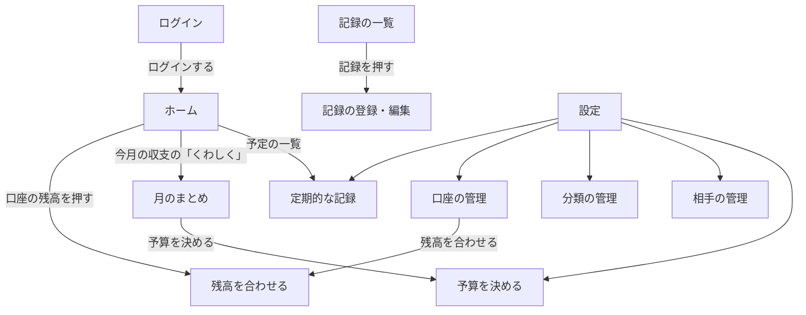

# 家計簿アプリ 画面設計書

## 1. この文書について

[要件定義書](要件定義書.md) の機能を、どの画面で・どのように使うかを決める。データの持ち方は [データベース設計書](データベース設計書.md) のとおり。

- 画面の図（ワイヤーフレーム）は、線と文字だけで「何を・どこに置くか」を表す。色やフォントは、作りながら決める。
- 金額などの数字は、すべて例。

## 2. 画面一覧

| No | 画面 | URL | 段階 | 何をする画面か |
|---|---|---|---|---|
| 1 | ログイン | `/login` | 1 | ログインする |
| 2 | ホーム | `/` | 1 | 今の残高、今月の収支（ひと目でわかる数字だけ）、記録するボタン。第 2 段階で、使える額・予定の一覧・金額が未入力のお知らせ（押すとその場で開き、金額を入れられる）を足す |
| 3 | 記録の一覧 | `/records` | 1 | 記録を見る・探す。第 2 段階で検索・絞り込みを足す |
| 4 | 記録の登録・編集 | `/records/create`<br>`/records/{id}/edit` | 1 | 収入・支出・移動を入力する。新しい相手もここで追加できる |
| 5 | 月のまとめ | `/summary` | 1 | 月を切りかえて（過去の月も）、収支・分類ごとの合計・相手ごとの合計を見る。第 3 段階で予算の状況とグラフを足す |
| 6 | 口座の管理 | `/accounts` | 1 | 口座の追加・変更・削除・使わない、最初の残高 |
| 7 | 残高を合わせる | `/accounts/{id}/adjust` | 1 | 実際の金額を入れて、差を「調整」の記録として残す。ホームの残高の一覧と、口座の管理から開く |
| 8 | 分類の管理 | `/categories` | 1 | 大分類・小分類の追加・変更・削除・使わない |
| 9 | 相手の管理 | `/partners` | 1 | 相手の追加・変更・削除・使わない |
| 10 | 定期的な記録 | `/recurrings` | 2 | 上：月ごとの金額（月を切りかえて、見る・入れる・直す）。下：予定の登録・変更・使わない |
| 11 | 予算を決める | `/budgets` | 3 | ふだんの予算と、特別な月だけの予算を決める。予算の状況は月のまとめで見る |
| 12 | 設定 | `/settings` | 1 | 定期的な記録・口座・分類・相手・予算の画面へのリンクを並べる。スマホのメニューの「設定」から開く（パソコンでは、左のメニューに全部出る） |

- URL は、扱うテーブルの名前を最初に置く（例：口座 → accounts → `/accounts`）。月のまとめは、1 つのテーブルではなく記録を集計する画面なので、「まとめ」の英語 summary にした。
- `{id}` には、記録や口座の番号が入る（例：5 番の記録の編集 → `/records/5/edit`）。
- 口座・分類・相手・定期的な記録の追加・変更を、一覧の中でするか別の画面にするかは、画面ごとの設計（5 章）で決める。
- ログアウトは画面ではなく、メニューのボタン。
- 設定は、1 つのテーブルではなく、ほかの画面へのリンクを並べる画面なので、「設定」の英語 settings にした。

## 3. 画面遷移

### 3.1 メニュー

よく使う画面は常に見えるところに出し、たまにしか使わない画面は「設定」にまとめる。どの画面からでも、1 回押すだけで記録の登録画面へ行けるようにする（記録はいちばんよく使う操作で、たどり着くまでの手間が多いと続かないため）。

| | スマホ | パソコン |
|---|---|---|
| メニューの場所 | 画面のいちばん下（親指で押しやすい） | 画面の左側 |
| 常に出すもの | ホーム・記録の一覧・＋（記録する）・月のまとめ・設定 | ホーム・記録の一覧・月のまとめ・定期的な記録・口座・分類・相手・予算 |
| 記録する | メニューのまん中の「＋」 | 画面の右下に浮かべた「＋ 記録する」ボタン |
| ログアウト | 画面の上 | 画面の上 |

- ログイン画面には、メニューを出さない。
- 定期的な記録（第 2 段階）と予算（第 3 段階）は、その段階になってからメニューに足す。

### 3.2 画面遷移図

メニュー（3.1）からは、ログイン以外のどの画面へも行ける。下の図は、メニュー以外の移り方（画面の中のボタンやリンク）を表す。



- ログインしていないときは、どの画面を開いてもログイン画面になる。ログアウトしたときも、ログイン画面に戻る。
- 記録の登録・編集で保存したあとにどの画面へ行くか（元の画面に戻る、続けて次を入力する など）は、記録の登録・編集の画面の設計（5 章）で決める。

## 4. 全画面に共通の決まり

| | 決まり | 理由 |
|---|---|---|
| 1 | 画面の幅に合わせて並べ方を変える（レスポンシブ）。パソコンでは四角（ブロック）を横に並べ、スマホでは縦 1 列にする | 家ではパソコン、外ではスマホで、思い出したその場で入力できるようにするため |
| 2 | 入力のまちがいは、その欄のすぐ下に赤い字で出す（例：「金額は 1 円以上で入れてください」）。入れた内容は消さない | どこが・なぜまちがいかがすぐわかり、全部を入れ直さなくて済むため |
| 3 | 保存・削除できたときは、画面の上に「保存しました」などと数秒だけ出す | ちゃんと保存されたかを確かめられるようにするため |
| 4 | 金額は 3 けたごとにカンマで区切る（12,800）。マイナスは「-」をつけて赤い字にする | 読みまちがいを防ぎ、カードの残高などのマイナスを目立たせるため |
| 5 | 日付は「10月9日（金）」の形にする。今年でないときだけ年をつける | 曜日があると、いつのことかを思い出しやすいため |
| 6 | データがまだないとき（記録が 0 件など）は、空白にせず「まだ記録がありません」と、次にすること（「＋ 記録する」など）を出す | 使い始めに、何をすればよいかわかるようにするため |
| 7 | 日付と時刻は日本時間で扱う | サーバー（AWS）はシドニーにあるため、明示しておく |
| 8 | 削除の前に、確認の小窓（ダイアログ）を出す：「この記録を削除しますか？［削除する］［やめる］」 | 削除は元に戻せないため。削除は毎日する操作ではないので、1 手増えても負担は小さい |
| 9 | 記録がある口座・分類・相手・定期的な記録は削除できない（要件定義書 5.4）。削除を押したときは「記録があるので削除できません。『使わない』にしますか？」と出す | 削除できない理由と、かわりにできることがすぐわかるようにするため |

## 5. 画面ごとの設計

画面ごとに、次の 4 つを決める。

1. URL
2. 出すもの（ワイヤーフレーム）と、どのテーブルから取るか
3. 入力欄とチェック
4. ボタンと、押したらどこへ行くか

### 5.1 ログイン

**URL**：`/login`

**出すもの**

```
┌──────────────────────────┐
│           家計簿            │
│                            │
│ メールアドレス               │
│ [                        ] │
│ パスワード                  │
│ [                        ] │
│                            │
│ [✓] ログインしたままにする     │
│                            │
│        [ ログイン ]          │
└──────────────────────────┘
```

- 使うテーブル：users
- メニューは出さない（3.1）。
- ユーザー登録とパスワードリセットのリンクは出さない（要件定義書 5.7）。

**入力欄とチェック**

| 欄 | チェック |
|---|---|
| メールアドレス | 必須。メールアドレスの形 |
| パスワード | 必須 |
| ログインしたままにする | 最初からチェックを入れておく |

- メールアドレスかパスワードがちがうときは、「メールアドレスかパスワードがちがいます」と出す。どちらがちがうかは言わない。
- 続けてまちがえたときは、しばらくログインできなくする（Laravel にある仕組みを使う。1 分に 5 回まで）。
- 「ログインしたままにする」にチェックを入れると、ブラウザを閉じてもログインが続く。自分のスマホ・パソコンでは毎回ログインしなくて済み、人のパソコンではチェックを外せる。

**ボタンと移り先**

| ボタン | 押したら |
|---|---|
| ログイン | 合っていればホームへ。ログインする前にほかの画面を開こうとしていたときは、その画面へ |

### 5.2 ホーム

**URL**：`/`

**出すもの**

上から「急ぎのこと → 今いくら使えるか → 今いくらあるか → 今月どうか → これから → 最近」の順に並べる。パソコンでは四角を横 2 列に並べる（4 章の 1）。

```
┌──────────────────────────────┐
│ 家計簿                  ログアウト │
├──────────────────────────────┤
│ お知らせ                        │ ← 第2・3段階。あるときだけ出る
│  金額がまだのものが 3 件あります ▼ │
│  趣味・娯楽が予算をこえました     ▶ │
├──────────────────────────────┤
│ 使える額          37,900 円     │ ← 第2段階
│  1日あたり 1,647 / 1週間 11,530  │
├──────────────────────────────┤
│ 貯金の目標                      │ ← 第3段階
│  旅行 120,000 / 300,000 ■■□□□  │
├──────────────────────────────┤
│ 今の残高                        │
│  銀行口座            412,000 ›  │
│  現金                  8,500 ›  │
│  カードA             -48,300 ›  │
│  合計                352,900    │
├──────────────────────────────┤
│ 今月（10月）の収支               │
│  収入 0 / 支出 48,600 / 差 -48,600│
│  多く使った分類：食費 18,200 …    │
│                 くわしく ▶      │
├──────────────────────────────┤
│ これからの予定（今月）            │ ← 第2段階
│  10月15日（木）カードA  概算 52,000│
├──────────────────────────────┤
│ 最近の記録                      │
│  10月9日（金）コンビニ       680  │
│                記録の一覧へ ▶    │
├──────────────────────────────┤
│ ホーム 記録の一覧 ＋ 月のまとめ 設定 │ ← スマホのメニュー（3.1）
└──────────────────────────────┘
```

| 四角 | 段階 | 中身 | 使うテーブル |
|---|---|---|---|
| お知らせ | 2・3 | 下の「お知らせ」のとおり。何もないときは、四角ごと出さない | recurrings・recurring_amounts・accounts・records・budgets |
| 使える額 | 2 | 使える額をいちばん大きな字で出す。その下に 1 日あたり・1 週間あたりの額と、計算の内訳 | accounts・records・recurrings・recurring_amounts |
| 貯金の目標 | 3 | 目標ごとに、口座の今の残高 / 目標額と、棒 | goals（新しく作る）・accounts・records |
| 今の残高 | 1 | 口座ごとの今の残高と合計。「使わない」口座は出さない。取っておく額がある口座は、その額も小さく出す（第 2 段階） | accounts・records |
| 今月の収支 | 1 | 今月の収入・支出・差と、多く使った大分類 3 つ | records・categories |
| これからの予定 | 2 | 今日から今月末までの、まだ記録されていない定期的な記録。金額がまだのものは「概算」と出す | recurrings・recurring_amounts・records |
| 最近の記録 | 1 | 最後に入力した記録 5 件（入力した順）。入れたものがちゃんと入ったかを、すぐ確かめられるようにする | records・categories・partners・accounts |

**計算の決まり**

- 使える額 ＝ 今の合計残高 − 取っておく額の合計 − 今月末までに引き落とされる予定（要件定義書 5.5）
- 1 日あたり ＝ 使える額 ÷ 今月の残りの日数（今日をふくむ）。1 円未満は切り捨て。
- 1 週間あたり ＝ 1 日あたり × 7。月末まで 7 日ないときは、残りの日数をかける。
- 使える額がマイナスのときは、1 日あたり・1 週間あたりも、マイナスのまま赤い字で出す。

**お知らせ**

| お知らせ | 段階 | 出るとき | 押したら |
|---|---|---|---|
| 金額がまだのものが ○ 件あります | 2 | 金額が変わる定期的な記録で、今月の分（日付が過ぎたものもふくむ）の金額が入っていないとき | その場で開いて、金額を入れられる（下の「入力欄とチェック」） |
| ○○ が取っておく額を下回っています | 2 | 口座の残高が、取っておく額より少なくなったとき | 口座の管理へ |
| ○○ が予算をこえました（+○ 円） | 3 | 今月、その分類で使った額が予算をこえたとき | 月のまとめへ |
| ○○ が予算の ○% です（あと ○ 円） | 3 | 今月、その分類で使った額が予算の 80% 以上になったとき | 月のまとめへ |

- 来月以降の分の金額は、ホームでは入れない。定期的な記録の画面の「月ごとの金額」で入れる（5.10）。
- 記録のつけ忘れを知らせるお知らせは作らない。給料など決まったものは「金額がまだ」のお知らせで、ふだんの買い物は「最近の記録」の日付で気づける。

**入力欄とチェック**

お知らせの「金額がまだ」を開いたときだけ、入力欄が出る。

| 欄 | チェック |
|---|---|
| 金額（定期的な記録ごと） | 空でもよい（空のものは保存しない）。入れるときは 1 円以上の整数。欄には概算を薄い字で出しておく |

- 「今回はなし」を押したものは、その月は記録せず、お知らせからも消える。

**ボタンと移り先**

| ボタン・リンク | 押したら |
|---|---|
| お知らせ（金額がまだ） | その場で開く・閉じる |
| まとめて保存 | 入れた金額を保存してホームに戻る。日付が過ぎていたものは、このときに予定の日付で記録する |
| 今回はなし | その月は記録しないことにして、お知らせから消す |
| 口座の残高 | 残高を合わせる（5.7）へ |
| くわしく | 月のまとめ（5.5）の今月へ |
| これからの予定の行 | 定期的な記録（5.10）へ |
| 最近の記録の行 | 記録の編集（5.4）へ |
| 記録の一覧へ | 記録の一覧（5.3）へ |
